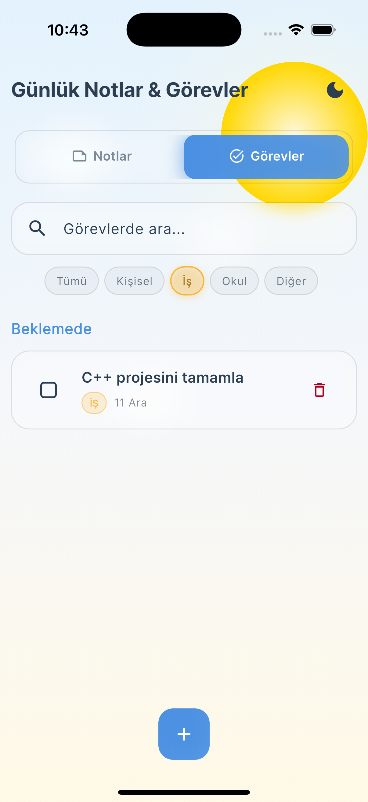
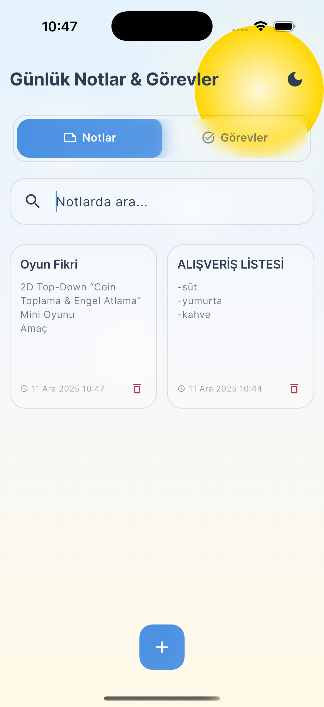
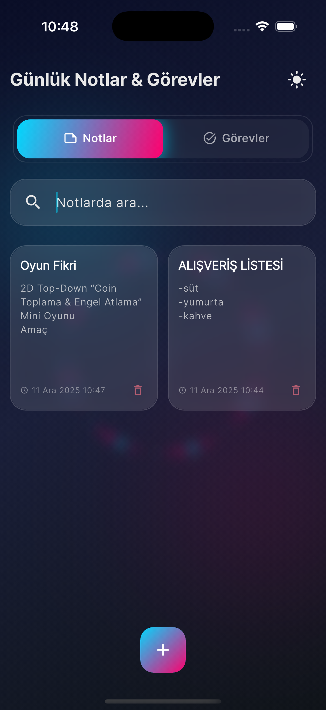
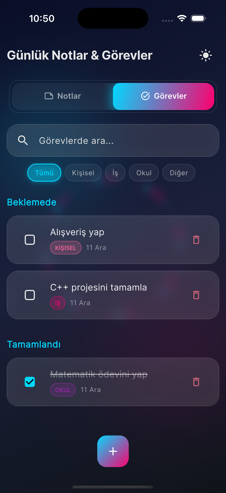

# Günlük Notlar & Görevler 📝

Spatial glass efektleri ve modern UI/UX tasarımına sahip, günlük notlar ve görevleri yönetmek için Flutter uygulaması.

## 📱 Ekran Görüntüleri

<div align="center">
  
  
  
  
</div>

## ✨ Özellikler

### Fonksiyonel Özellikler
- **Not Yönetimi**: Başlık, içerik ve tarih ile notlar oluşturma, görüntüleme ve silme
- **Görev Yönetimi**: Görev ekleme, tamamlanma durumunu işaretleme ve kategorilere göre organize etme
- **Kategoriler**: Görevleri Kişisel, İş, Okul veya Diğer kategorilerine göre organize etme
- **Arama & Filtreleme**: Notlar ve görevlerde arama yapma, görevleri kategoriye göre filtreleme
- **Koyu/Açık Tema**: Spatial glass efektleri ile modern temalar
- **Yerelleştirme**: İngilizce ve Türkçe dil desteği

### Tasarım Özellikleri
- **Spatial Glass Efektleri**: Bulanık efektlerle donuk cam kartlar
- **Animasyonlu Arka Planlar**: 
  - Açık tema: Animasyonlu güneş ve bulutlar
  - Koyu tema: Neon parçacıklar ve parlayan efektler
- **Yumuşak Animasyonlar**: Sayfa geçişleri, Hero animasyonları ve kart animasyonları
- **Modern UI/UX**: Temiz, sezgisel arayüz

## 🏗️ Mimari

Proje **Clean Architecture** prensiplerini takip eder:

```
lib/
├── core/              # Core utilities, constants, themes
│   ├── constants/
│   ├── theme/
│   ├── utils/
│   └── widgets/
├── domain/            # Business logic layer
│   ├── entities/
│   └── repositories/
├── data/              # Data layer
│   ├── database/
│   └── repositories/
└── presentation/      # UI layer (MVVM)
    ├── screens/
    ├── viewmodels/
    ├── widgets/
    └── providers/
```

### Mimari Prensipleri
- **Clean Architecture**: Domain, Data ve Presentation katmanları ile ayrım
- **MVVM Pattern**: State management için ViewModels
- **SOLID Prensipleri**: İyi yapılandırılmış, bakımı kolay kod tabanı
- **Provider**: Provider pattern ile state management
- **Modüler Yapı**: Her özellik ayrı dosyalarda

## 🚀 Kurulum & Çalıştırma

### Gereksinimler
- **Flutter SDK**: >=3.0.0 <4.0.0
- **Dart SDK**: >=3.0.0

### Adımlar

1. **Projeyi Klonlayın**
   ```bash
   git clone <repository-url>
   cd todo_note
   ```

2. **Bağımlılıkları Yükleyin**
   ```bash
   flutter pub get
   ```

3. **Yerelleştirme Dosyalarını Oluşturun**
   ```bash
   flutter gen-l10n
   ```

4. **Uygulamayı Çalıştırın**
   ```bash
   flutter run
   ```

### Platforma Özel Çalıştırma
- **iOS**: `flutter run -d ios`
- **Android**: `flutter run -d android`
- **Web**: `flutter run -d chrome`
- **macOS**: `flutter run -d macos`

## 🛠️ Kullanılan Teknolojiler

- **Flutter**: UI framework
- **Provider**: State management
- **SQLite (sqflite)**: Yerel veritabanı
- **Shared Preferences**: Tema kalıcılığı
- **Google Fonts**: Tipografi
- **Flutter Localizations**: Yerelleştirme

### Bağımlılıklar

```yaml
dependencies:
  flutter:
    sdk: flutter
  flutter_localizations:
    sdk: flutter
  provider: ^6.1.1
  sqflite: ^2.3.0
  path: ^1.8.3
  shared_preferences: ^2.2.2
  google_fonts: ^6.1.0
```

## 🎬 Animasyonlar

Uygulama, kullanıcı deneyimini geliştirmek için çeşitli animasyonlar içerir:

- **Page Transition Animasyonları**: Fade, Slide ve Scale geçiş efektleri
- **Hero Animasyonları**: Widget'ların ekranlar arasında sorunsuz geçişi
- **AnimatedCard**: Kartların fade ve slide ile görünmesi
- **Tab Transitions**: Tab değişimlerinde yumuşak geçişler
- **Button Animations**: Butonlarda hover ve press efektleri

## 🔄 State Management

Uygulama **Provider** kullanarak state management yapar:
- `ThemeProvider`: Tema durumunu yönetir
- `NoteViewModel`: Not durumunu ve işlemlerini yönetir
- `TaskViewModel`: Görev durumunu ve işlemlerini yönetir

## 🌍 Yerelleştirme

Desteklenen diller:
- İngilizce (en)
- Türkçe (tr)

Yerelleştirme dosyaları `lib/l10n/` dizininde ARB formatında bulunur.

## 📝 Kod Yapısı

### Domain Layer
- **Entities**: `Note`, `Task` - Saf iş nesneleri
- **Repositories**: Veri işlemlerini tanımlayan arayüzler

### Data Layer
- **Database Helper**: SQLite kurulumu ve yönetimi
- **Repository Implementations**: Domain repository'lerinin somut implementasyonları

### Presentation Layer
- **ViewModels**: İş mantığı ve state management
- **Screens**: Özelliklere göre organize edilmiş UI ekranları
- **Widgets**: Yeniden kullanılabilir UI bileşenleri
- **Providers**: Dependency injection kurulumu

## 🎨 Tasarım Felsefesi

- **Spatial Design**: Arka planlar derinlik hissi veren tuval görevi görür
- **Glass Morphism**: Modern donuk cam efektleri
- **Yumuşak Animasyonlar**: Keyifli kullanıcı etkileşimleri

## 🎯 Gelecek Geliştirmeler

Mimari, kolayca şunları destekleyecek şekilde tasarlanmıştır:
- Bulut senkronizasyonu
- Çoklu kullanıcı hesapları
- Zengin metin düzenleme
- Görev hatırlatıcıları
- Not ekleri
- Dışa aktarma işlevselliği

## 📄 Lisans

Bu proje bir case study olarak oluşturulmuştur.

---

Flutter ile ❤️ ile oluşturuldu
# to-do-app-case-study-3
